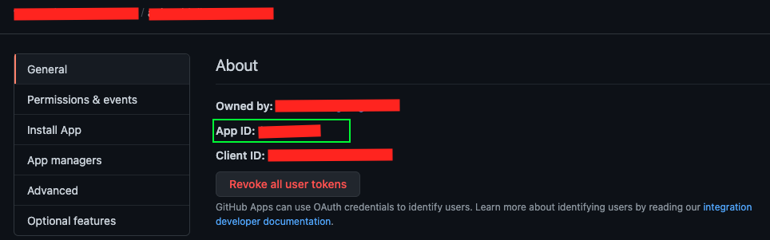

# GitHub Application Token Action

The GitHub Action which provides a token of an installed GitHub application. The token can be used later to perform
operations using [GitHub API](https://docs.github.com/en/rest).

## Inputs

### `application_id`

**Required** GitHub Application ID.

#### How to obtain the application ID?

1. Navigate to _Settings -> Developer Settings -> GitHub Apps_.
2. Find the application you have created and click _Edit_
   
   
3. Copy GitHub Application Id from the `App ID` property
   
   
4. Open your repository _Settings -> Secrets_ and add a new _Repository secret_ with the app ID as a secret value.

### `app_private_key`

**Required** GitHub application private key.

#### How to obtain the private key?

1. Navigate to _Settings -> Developer Settings -> GitHub Apps_.
2. Find the application you have created and click _Edit_
   

3. Scroll down to _Private keys_ section.
   

4. Click on _Generate a private key_ button. This would trigger a key download.
   **Do not lose the key. If you loose it, then you need to generate a new key**.

5. Open your repository _Settings -> Secrets_ and add a new _Repository secret_. Add the content of the file from a
   previous step as a secret value.

## Outputs

### `gh_access_token`

GitHub access token which allows to perform actions using [GitHub API](https://docs.github.com/en/rest). The token is
valid only for 10 minutes.

## Example usage

The example below demonstrates how to create an issue from a GitHub action in another repository using a token obtained
from the installed GitHub App. Note that GitHub App should have access to the another repository.

```yaml
      - uses: actions/checkout@v2

      # Add this action to steps
      - id: get-gh-app-token
        uses: vadeg/github-app-token-action@v0.0.1
        with:
          app_private_key: ${{ secrets.YOUR_PRIVATE_KEY_SECRET_NAME }}
          application_id: ${{ secrets.YOUR_APPLICATION_ID_SECRET_NAME }}

      # Runs a single command using the runners shell
      - name: Create Github Issue
        env:
          # Obtain a token from a previous step using step ID
          GH_TOKEN: ${{ steps.get-gh-app-token.outputs.gh_access_token }}
        run: |        
          curl -X POST \ 
           -H "Accept: application/vnd.github.v3+json" \
           -H "Authorization: token $GH_TOKEN" \
           # Place here the YOUR_ORG name and YOUR_REPO name where you want to create an issue
           https://api.github.com/repos/:YOUR_ORG/:YOUR_REPO/issues \
           -d '{"title" : "Test Issue Title", "body" : "This is an issue created by GitHub Action"}'
```

## Additional Resources

* [How to create GitHub App](https://docs.github.com/en/developers/apps/building-github-apps/creating-a-github-app)
* [Public and private GitHub Apps](https://docs.github.com/en/developers/apps/managing-github-apps/making-a-github-app-public-or-private)
* [GitHub REST API Authentication](https://docs.github.com/en/rest/overview/resources-in-the-rest-api#authentication)